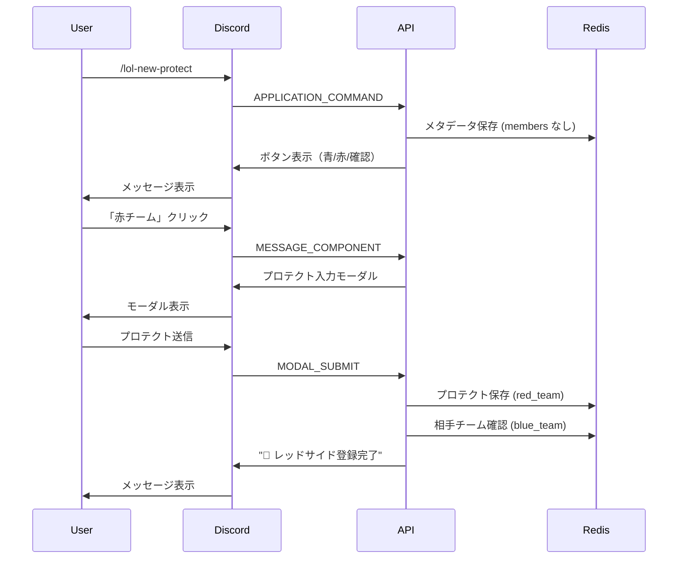
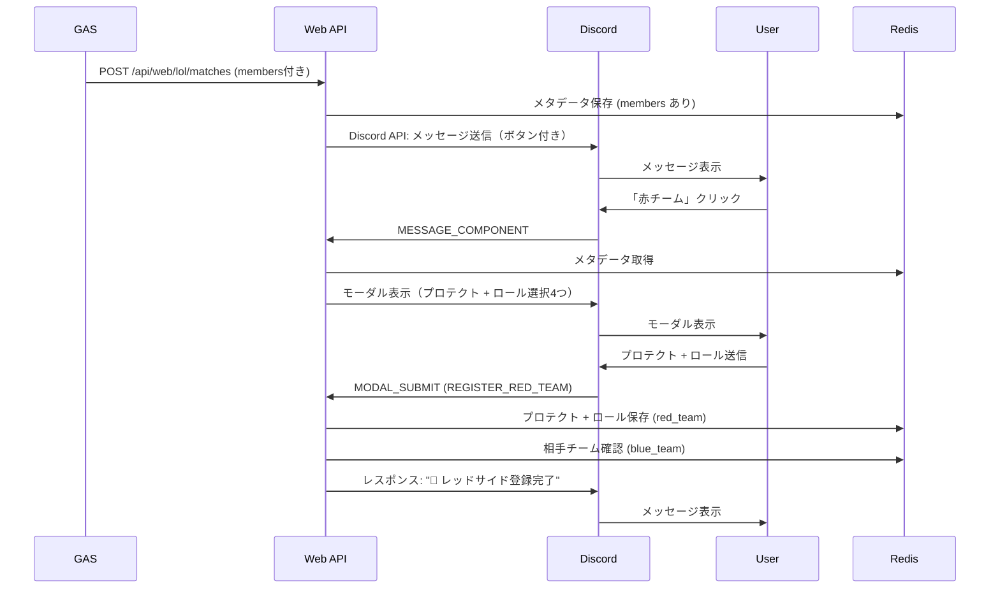

# 20260214-1-メンバー・ロール割り当て機能追加

## 1. 背景・目的

プロテクト機能に加えて、各チームのメンバーとそのロール（top, jg, mid, adc, sup）を登録できるようにする。
これにより、チーム編成を明確にし、試合進行をスムーズにする。

## 2. 実装内容

### 2.1 Web API への引数追加

**ファイル**: `member-role/my-app/app/api/web/lol/matches/route.ts`

#### 新規引数とその型定義（型安全性の確保）

親子関係を明確にした型定義:

```typescript
type CreateMatchRequest = {
  guild_id: string
  channel_id: string
  isProtect?: boolean
  isRoleSelect?: boolean  // ロール選択を実施するかどうか。デフォルト: false
  members?: {
    blueTeam: string[] // 青チームのメンバー（5名、必須）
    redTeam: string[]  // 赤チームのメンバー（5名、必須）
  }
}
```

**注**: 現在の仕様では `isRoleSelect: true` の場合、`members` が必須です。`members` なしでロール選択する機能は**未実装**としてクライアントにエラーを返します。

#### バリデーション

1. **`isRoleSelect` と `members` の整合性チェック**:
   - `isRoleSelect: true` の場合、`members` が存在すること
   - 存在しない場合はエラー: **「isRoleSelect: true で members なしの機能は未実装です」**
   - 注: 将来的に `isRoleSelect: true` かつ `members: undefined` の独自フローを実装予定

2. **`isRoleSelect` の型チェック**:
   - `isRoleSelect` が boolean または undefined であること

3. **`members` の型チェック**（`members` が存在する場合のみ）:
   - `members` がオブジェクトであること
   - `members.blueTeam` が配列であること
   - `members.redTeam` が配列であること

4. **`members` の長さチェック**（`members` が存在する場合のみ）:
   - `members.blueTeam.length === 5`
   - `members.redTeam.length === 5`

5. **`members` の要素チェック**（`members` が存在する場合のみ）:
   - 各要素が文字列であること
   - 各要素が空文字列でないこと
   - 各要素に重複が無いこと

6. **機能有効性チェック**:
   - `isProtect` と `isRoleSelect` の少なくとも一方が `true` であること
   - どちらも `false` の場合はエラー

7. **クロスチームメンバー重複チェック**（`members` が存在する場合のみ）:
   - `members.blueTeam` と `members.redTeam` に同じメンバーが存在しないこと
   - 重複がある場合はエラー

### 2.2 Redisデータ構造（全体像）

この機能で使用するRedisのキーと値の構造を示します。

#### メタデータ（試合の設定情報）

**キー**: `lol:matches:${matchId}:meta`

```typescript
{
  match_id: string          // 試合ID（UUID）
  created_at: string        // 作成日時（ISO 8601形式）
  isProtect: boolean        // プロテクト機能の有無
  isRoleSelect: boolean     // ロール選択機能の有無【新規】
  members?: {               // メンバーリスト【新規】
    blueTeam: string[]      // 青チームのメンバー（5名）
    redTeam: string[]       // 赤チームのメンバー（5名）
  }
}
```

**例**:

```typescript
// プロテクト + ロール選択 + メンバー指定の場合
{
  match_id: "abc123-def456",
  created_at: "2026-02-14T12:00:00.000Z",
  isProtect: true,
  isRoleSelect: true,
  members: {
    blueTeam: ["player1", "player2", "player3", "player4", "player5"],
    redTeam: ["player6", "player7", "player8", "player9", "player10"]
  }
}
```

#### チームデータ（各チームの登録情報）

**キー**: `lol:matches:${matchId}:blue_team` または `lol:matches:${matchId}:red_team`

```typescript
{
  updated_at: string                 // 更新日時（ISO 8601形式）
  protection_champions?: string      // プロテクトチャンピオン（isProtect: true の場合のみ）
  roster?: {                         // ロール割り当て（isRoleSelect: true の場合のみ）【新規】
    top: string
    jg: string
    mid: string
    adc: string
    sup: string
  }
}
```

**例**:

```typescript
// プロテクト + ロール選択の場合
{
  updated_at: "2026-02-14T12:01:00.000Z",
  protection_champions: "モルガナ、メル",
  roster: {
    top: "player1",
    jg: "player2",
    mid: "player3",
    adc: "player4",
    sup: "player5"
  }
}

// プロテクトのみの場合（既存フロー）
{
  updated_at: "2026-02-14T12:01:00.000Z",
  protection_champions: "モルガナ、メル"
}

// ロール選択のみの場合
{
  updated_at: "2026-02-14T12:01:00.000Z",
  roster: {
    top: "player1",
    jg: "player2",
    mid: "player3",
    adc: "player4",
    sup: "player5"
  }
}
```

### 2.3 型定義の更新

**ファイル**: `member-role/my-app/app/types/match.ts`

```typescript
export type ProtectMatchMeta = {
  match_id: string
  created_at: string
  isProtect: boolean
  isRoleSelect: boolean  // ロール選択の有無【新規】
  members?: {  // メンバーリスト【新規】
    blueTeam: string[]
    redTeam: string[]
  }
}

export type ProtectTeamData = {
  updated_at: string
  protection_champions?: string  // isProtect が true の場合のみ存在
  roster?: {  // isRoleSelect が true の場合のみ存在【新規】
    top: string
    jg: string
    mid: string
    adc: string
    sup: string
  }
}
```

**型設計のポイント**:

- `ProtectMatchMeta.isProtect` は **必須（boolean）** → プロテクト機能の有無を示す
- `ProtectMatchMeta.isRoleSelect` は **必須（boolean）** → ロール選択機能の有無を示す
- `ProtectMatchMeta.members` は **オプショナル** → `members` なしの既存フローをサポート
- `ProtectTeamData.protection_champions` は **オプショナル** → `isProtect: false` の場合は存在しない
- `ProtectTeamData.roster` は **オプショナル** → `isRoleSelect: false` の場合は存在しない

**注**: オプショナルプロパティによる型定義は完全な型安全性を提供しませんが、モーダル送信処理では `getValue` ヘルパー関数（セクション2.4.1参照）を使用して `custom_id` ベースで値を取得することで、実装レベルでの安全性を確保します。

以上により、型だけでプロテクト、メンバー登録、ロール選択をそれぞれ独立した機能として扱います。

### 2.4 モーダルへのセレクター追加

**ファイル**: `member-role/my-app/app/api/discord/application-command/newProtect.ts`

#### モーダル表示の対象関数

- `handleOpenModalBlueTeam`,  `handleOpenModalRedTeam`

#### モーダル表示の処理フロー

1. Redisから `lol:matches:${matchId}:meta` を取得
2. **分岐処理**:
   - **ケース1: `meta.isProtect === true`** → プロテクト入力のinput（既存）
   - **ケース2: `meta.isRoleSelect === true`** → ロール選択4つのselector（新規）
     - 注: `meta.members` が存在しない場合はエラー（Web API のバリデーションで弾かれるため通常発生しない）
   - **ケース3: どちらも`true`** → 両方のinput, selectorを表示
   - **ケース4: どちらも`false`** → modalは表示せず、「入力が求められている情報がありません。プロテクトの宣言もロール振り分けも不要です。」として本人だけに表示(64)を返す。

#### 追加コンポーネント（ケース2, 3）

- 4つの String Select Menu（type: 3）
- custom_id: `role_top?match_id=${matchId}`, `role_jg?match_id=${matchId}`, `role_mid?match_id=${matchId}`, `role_adc?match_id=${matchId}`
- label: "Top", "Jungle", "Mid", "ADC"
- options: 各チームの  `members.blueTeam` または`members.redTeam` 配列から生成
  - 例: `[{ label: "player1", value: "player1" }, { label: "player2", value: "player2" }, ...]`
- required: true（各セレクトメニューで必須選択）

#### Supportロールの自動割り当て

- 選択されなかった残り1人を自動的に `sup` として割り当て

**モーダル構造（membersがある場合）**:

```typescript
{
  type: 9,
  data: {
    custom_id: CLIENT_ACTIONS.REGISTER_RED_TEAM,
    title: "レッドサイド",
    components: [
      {
        type: 1, // Action Row
        components: [
          {
            type: 4, // Text Input
            custom_id: `protection_champions?match_id=${matchId}`,
            label: "プロテクトするチャンプを入力",
            style: 1,
            required: true,
            placeholder: "例：モルガナ、メル",
          },
        ],
      },
      {
        type: 18, // Label (String Select用)
        label: "Top",
        component: {
          type: 3, // String Select
          custom_id: `role_top?match_id=${matchId}`,
          placeholder: "Topを選択",
          options: [
            { label: "player1", value: "player1" },
            // ...
          ],
        },
      },
      {
        type: 18, // Label (String Select用)
        label: "Jungle",
        component: {
          type: 3, // String Select
          custom_id: `role_jg?match_id=${matchId}`,
          placeholder: "Jungleを選択",
          options: [...],
        },
      },
      {
        type: 18, // Label (String Select用)
        label: "Mid",
        component: {
          type: 3, // String Select
          custom_id: `role_mid?match_id=${matchId}`,
          placeholder: "Midを選択",
          options: [...],
        },
      },
      {
        type: 18, // Label (String Select用)
        label: "ADC",
        component: {
          type: 3, // String Select
          custom_id: `role_adc?match_id=${matchId}`,
          placeholder: "ADCを選択",
          options: [...],
        },
      },
    ],
  },
}
```

**💡 ポイント**: Discordのモーダルは**最大5つのAction Rowまで**。
プロテクト入力（1つ）+ ロール選択（5つ）= 合計6つは実装できません。
しかし、SupportロールのRowを省略し、選択されなかったメンバーを自動的に割り当てることで解決します。

**処理フロー**:

1. 「青チーム」「赤チーム」ボタン → モーダル表示
   - `isProtect: true`: プロテクト入力のinput（既存）
   - `isRoleSelect: true`: Role割り当てのselector 4つ(TOP, JG, MID, ADC)
   - trueが無いとき: モーダルは表示せず、「入力が求められている情報がありません。プロテクトの宣言もロール振り分けも不要です。」(flags: 64)
2. モーダル送信 → Redis保存 → 完了メッセージ

### 2.4.1 getValue ヘルパー関数（型安全なモーダルデータ取得）

モーダル送信データから`custom_id` ベースで値を取得するヘルパー関数を実装します。

**ファイル**: `member-role/my-app/app/api/discord/application-command/newProtect.ts`

```typescript
/**
 * モーダル送信データから custom_id で値を取得
 * @param customId - 検索する custom_id（前方一致）
 * @param data - モーダル送信データ
 * @returns 取得した値（Text Input の value または Select Menu の values[0]）
 */
function getValue(customId: string, data: any): string | undefined {
  const component = data.components
    .flatMap((row: any) => row.components)
    .find((c: any) => c.custom_id?.startsWith(customId))

  // Text Input の場合は value、Select Menu の場合は values[0]
  return component?.value ?? component?.values?.[0]
}
```

**使用例**:

```typescript
// プロテクトチャンピオン取得（Text Input）
const protectionChampions = getValue("protection_champions", data)

// ロール選択取得（Select Menu）
const selectedRoles = {
  top: getValue("role_top", data),
  jg: getValue("role_jg", data),
  mid: getValue("role_mid", data),
  adc: getValue("role_adc", data),
}
```

**メリット**:

- ✅ モーダルの順序変更に影響されない
- ✅ `custom_id` で検索するため、明示的で読みやすい
- ✅ Text Input と Select Menu の両方に対応
- ✅ 存在しない場合は `undefined` を返すため、エラーハンドリングしやすい

### 2.5 モーダル送信処理の更新

**ファイル**: `member-role/my-app/app/api/discord/application-command/newProtect.ts`

#### モーダル送信の対象関数

- `handleRegisterBlueTeam`, `handleRegisterRedTeam`

#### モーダル送信の処理フロー

1. **メタデータ取得**:
   - Redisから `lol:matches:${matchId}:meta` を取得

2. **分岐処理**（`meta.isProtect` と `meta.isRoleSelect` の組み合わせで4パターン）:

   **ケース1: `isProtect: true, isRoleSelect: false`**（プロテクトのみ、既存フロー）:

   a. **プロテクトチャンピオン取得**:
      - `data.components[0].components[0].value` → protection_champions

   b. **Redisに保存**:
      - Redisキー: `lol:matches:${matchId}:blue_team` または `red_team`
      - Redis値: `{ protection_champions, updated_at }`

   c. **相手チーム確認 → メッセージ返却**

   **ケース2: `isProtect: false, isRoleSelect: true`**（ロール選択のみ、新規フロー）:

   a. **ロール選択値の取得**（helper関数使用）:
      - `getValue("role_top", data)` → top
      - `getValue("role_jg", data)` → jg
      - `getValue("role_mid", data)` → mid
      - `getValue("role_adc", data)` → adc

   b. **バリデーション**:
      - 4つのロールが全て選択されていること
      - 選択されたメンバーに重複がないこと

   c. **Supportロールの自動割り当て**:
      - メタデータから該当チームのメンバー配列を取得（`meta.members.redTeam` または `meta.members.blueTeam`）
      - 選択された4人を除外し、残り1人を自動的に `sup` として割り当て
      - sup割り当て候補が存在しない場合はエラー

   d. **Redisに保存**:
      - Redisキー: `lol:matches:${matchId}:red_team` または `blue_team`
      - Redis値: `{ roster: { top, jg, mid, adc, sup }, updated_at }`

   e. **相手チーム確認 → メッセージ返却**

   **ケース3: `isProtect: true, isRoleSelect: true`**（プロテクト + ロール選択、新規フロー）:

   a. **プロテクトチャンピオン取得**（helper関数使用）:
      - `getValue("protection_champions", data)` → protection_champions

   b. **ロール選択値の取得**（helper関数使用）:
      - `getValue("role_top", data)` → top
      - `getValue("role_jg", data)` → jg
      - `getValue("role_mid", data)` → mid
      - `getValue("role_adc", data)` → adc

   c. **バリデーション**:
      - 4つのロールが全て選択されていること
      - 選択されたメンバーに重複がないこと

   d. **Supportロールの自動割り当て**:
      - メタデータから該当チームのメンバー配列を取得
      - 選択された4人を除外し、残り1人を自動的に `sup` として割り当て
      - sup割り当て候補が存在しない場合はエラー

   e. **Redisに保存**:
      - Redisキー: `lol:matches:${matchId}:red_team` または `blue_team`
      - Redis値: `{ protection_champions, roster: { top, jg, mid, adc, sup }, updated_at }`

   f. **相手チーム確認 → メッセージ返却**

   **ケース4: `isProtect: false, isRoleSelect: false`**:
   - このケースではモーダルが表示されないため、モーダル送信は発生しない（通常発生しない）

#### 両チーム完了の判定条件

両チームのデータが揃っているか確認する際、以下の条件を満たす必要があります:

- **ケース1: `isProtect: true, isRoleSelect: false`**（プロテクトのみ）:
  - 両チームに `protection_champions` が存在すること（既存フロー）

- **ケース2: `isProtect: false, isRoleSelect: true`**（ロール選択のみ）:
  - 両チームに `roster` が存在すること

- **ケース3: `isProtect: true, isRoleSelect: true`**（プロテクト + ロール選択）:
  - 両チームに `protection_champions` と `roster` の両方が存在すること

- **ケース4: `isProtect: false, isRoleSelect: false`**:
  - 登録する項目がないため、完了判定は不要（このケースは通常使用されない）

#### 完了メッセージのフォーマット（Discord Embed形式・テーブル表示）

両チームが完了した際は、Discord Embedを使用して3カラムのテーブル形式で表示します。
**注**: `\u200B` はゼロ幅スペース（zero-width space）で、フィールド名を空白のように見せるために使用します。

**ケース1: `isProtect: true, isRoleSelect: false`（プロテクトのみ）**:

```typescript
{
  type: 4,
  data: {
    embeds: [{
      title: "✅ 結果発表",
      color: 3447003,
      fields: [
        {
            "name": "\u200B",
            "value": "**サイド**\nプロテクト",
            "inline": true
        },
        {
            "name": "🟦ブルーサイド",
            "value": "チーム1\nモルガナ、ニーコ",
            "inline": true
        },
        {
            "name": "🟥レッドサイド",
            "value": "チーム2\nアッシュ、アジール",
            "inline": true
        },
      ]
    }]
  }
}
```

**ケース2: `isProtect: false, isRoleSelect: true`（ロール選択のみ）**:

```typescript
{
  type: 4,
  data: {
    embeds: [{
      title: "✅ 結果発表",
      color: 3447003,
      fields: [
          {
            "name": "\u200B",
            "value": "**サイド**\nTOP:\nJG:\nMID:\nADC:\nSUP:",
            "inline": true
          },
          {
            "name": "🟦ブルーサイド",
            "value": "チーム1\nplayer1\nplayer2\nplayer3\nplayer4\nplayer5",
            "inline": true
          },
          {
            "name": "🟥レッドサイド",
            "value": "チーム2\nplayer6\nplayer7\nplayer8\nplayer9\nplayer10",
            "inline": true
          },
      ]
    }]
  }
}
```

**ケース3: `isProtect: true, isRoleSelect: true`（プロテクト + ロール選択）**:

```typescript
{
  type: 4,
  data: {
    embeds: [{
      title: "✅ 結果発表",
      color: 3447003,  // 青色
      fields: [
   {
            "name": "\u200B",
            "value": "**サイド**\nプロテクト\nTOP:\nJG:\nMID:\nADC:\nSUP:",
            "inline": true
          },
          {
            "name": "🟦ブルーサイド",
            "value": "チーム1\nモルガナ、ニーコ\nplayer1\nplayer2\nplayer3\nplayer4\nplayer5",
            "inline": true
          },
          {
            "name": "🟥レッドサイド",
            "value": "チーム2\nアッシュ、アジール\nplayer6\nplayer7\nplayer8\nplayer9\nplayer10",
            "inline": true
          },
      ]
    }]
  }
}
```

#### 片方のチーム完了時のメッセージ

片方のチームのみが完了した場合は、シンプルなテキストメッセージで返します：

```typescript
{
  type: 4,
  data: {
    content: "🔵 ブルーサイド登録完了",  // または "🔴 レッドサイド登録完了"
    flags: 64  // Ephemeralメッセージ（本人のみに表示）
  }
}
```

#### 確認ボタン押下時のメッセージ

確認ボタンを押した際も、両チーム完了時と同じEmbed形式で表示します。ただし、まだ登録されていないチームがある場合は、その旨を表示します：

**両チーム未完了の場合**:

```typescript
{
  type: 4,
  data: {
    content: "両チーム登録待ちです",
    flags: 64
  }
}
```

**片方のみ完了の場合**:

```typescript
{
  type: 4,
  data: {
    content: "🔵 ブルーサイドのみ登録済みです\n🔴 レッドサイドはまだ登録されていません",
    flags: 64
  }
}
```

**両チーム完了の場合**:

上記の「完了メッセージのフォーマット」と同じです。

#### Support自動割り当てロジック（実装イメージ）

```typescript
// 1. メタデータ取得
const meta = await redisGet<ProtectMatchMeta>(getMatchKey(matchId, "meta"))

// 2. プロテクトチャンピオン取得（meta.isProtect === true の場合のみ）
const protectionChampions = meta.isProtect
  ? getValue("protection_champions", data)
  : undefined

// 3. ロール選択の処理（meta.isRoleSelect === true の場合のみ）
let roster: { top: string; jg: string; mid: string; adc: string; sup: string } | undefined

if (meta.isRoleSelect) {
  // getValue関数を使用してcustom_idベースで取得（モーダルの順序に依存しない）
  const selectedRoles = {
    top: getValue("role_top", data),
    jg: getValue("role_jg", data),
    mid: getValue("role_mid", data),
    adc: getValue("role_adc", data),
  }

  // バリデーション: 全てのロールが選択されていることを確認
  if (!selectedRoles.top || !selectedRoles.jg || !selectedRoles.mid || !selectedRoles.adc) {
    return NextResponse.json({
      type: 4,
      data: { content: "エラー: 全てのロールに選手を割り振ってください", flags: 64 }
    })
  }

  // 選択された4人を配列化
  const selectedMembers = [selectedRoles.top, selectedRoles.jg, selectedRoles.mid, selectedRoles.adc]

  // 重複チェック
  const uniqueMembers = new Set(selectedMembers)
  if (uniqueMembers.size !== 4) {
    return NextResponse.json({
      type: 4,
      data: { content: "エラー: 同じメンバーが複数のロールに選択されています", flags: 64 }
    })
  }

  // メタデータからメンバー配列を取得
  if (!meta.members) {
    return NextResponse.json({
      type: 4,
      data: { content: "エラー: メンバー情報が見つかりません", flags: 64 }
    })
  }

  const teamMembers = team === "red" ? meta.members.redTeam : meta.members.blueTeam

  // 残り1人をsupとして自動割り当て
  const supMember = teamMembers.find(m => !selectedMembers.includes(m))

  if (!supMember) {
    return NextResponse.json({
      type: 4,
      data: { content: "エラー: Supportロールに割り当てるメンバーが見つかりません", flags: 64 }
    })
  }

  // 最終的なroster
  roster = {
    ...selectedRoles,
    sup: supMember
  }
}

// 4. Redisに保存
await redisSave(getMatchKey(matchId, team === "red" ? "red_team" : "blue_team"), {
  ...(protectionChampions && { protection_champions: protectionChampions }),
  ...(roster && { roster }),
  updated_at: new Date().toISOString()
})
```

**重要なポイント**:

- ✅ `getValue` 関数を使用して `custom_id` ベースで値を取得
- ✅ モーダルの順序変更に影響されない
- ✅ 型安全（存在しない場合は `undefined`）
- ✅ コードが読みやすく、メンテナンスしやすい

### 2.6 Embed メッセージ生成ヘルパー関数（テーブル形式）

完了メッセージを3カラムのテーブル形式のEmbed で生成するヘルパー関数を実装します。

**ファイル**: `member-role/my-app/app/api/discord/application-command/newProtect.ts`

```typescript
/**
 * 両チーム完了時のEmbedメッセージを生成（3カラムテーブル形式）
 */
function createCompletionEmbed(
  meta: ProtectMatchMeta,
  blueTeamData: ProtectTeamData,
  redTeamData: ProtectTeamData
) {
  const fields: Array<{ name: string; value: string; inline: boolean }> = []

  // ヘッダー行
  fields.push(
    { name: "\u200B",     value: "\u200B", inline: true },
    { name: "🔵 ブルー",   value: "\u200B", inline: true },
    { name: "🔴 レッド",   value: "\u200B", inline: true }
  )

  // プロテクト行（isProtect が true の場合のみ）
  if (meta.isProtect && blueTeamData.protection_champions && redTeamData.protection_champions) {
    // 要記述
  }

  // ロール行（isRoleSelect が true の場合のみ）
  if (meta.isRoleSelect && blueTeamData.roster && redTeamData.roster) {
    // 要記述
  }

  return {
    type: 4,
    data: {
      embeds: [{
        title: "✅ 両チーム登録完了",
        color: 3447003,
        fields
      }]
    }
  }
}
```

### 2.7 確認ボタンの更新

**ファイル**: `member-role/my-app/app/api/discord/application-command/newProtect.ts`

- **対象関数**: `handleCheckRegistered`
- **処理フロー**:
  1. メタデータと両チームのデータを取得
  2. 完了状態に応じて分岐:
     - 両チーム未完了: テキストメッセージ
     - 片方のみ完了: テキストメッセージ
     - 両チーム完了: `createCompletionEmbed()` を使用してEmbed形式で表示

**注**: route.ts の変更は不要です。既存の `REGISTER_RED_TEAM` / `REGISTER_BLUE_TEAM` ハンドラーを拡張するだけです。

## 3. 詳細仕様

### 3.1 バリデーション仕様

#### Web API（POST /api/web/lol/matches）

1. **members の型チェック**:
   - `members` がオブジェクトであること
   - `members.redTeam` が配列であること
   - `members.blueTeam` が配列であること

2. **members の長さチェック**:
   - `members.redTeam.length === 5`
   - `members.blueTeam.length === 5`

3. **members の要素チェック**:
   - 各要素が文字列であること
   - 各要素が空文字列でないこと

#### モーダル送信（ロール選択が含まれる場合）

1. **ロール入力チェック**（`meta.isRoleSelect === true` の場合のみ）:
   - top, jg, mid, adc の4つが全て選択されていること

2. **メンバー重複チェック**（`meta.isRoleSelect === true` の場合のみ）:
   - 選択された4人のメンバーに重複がないこと

3. **Support自動割り当てチェック**（`meta.isRoleSelect === true` の場合のみ）:
   - メタデータからメンバー配列を取得できること
   - 選択された4人を除外して、残り1人が存在すること

4. **相手チーム完了チェック**:
   - 各ケースに応じた完了条件を確認（「両チーム完了の判定条件」セクション参照）

### 3.2 Discord コンポーネント custom_id 一覧

| custom_id | 説明 |
| --------- | ---- |
| `CLIENT_ACTIONS.OPEN_MODAL_BLUE_TEAM_REGISTER` | 青チーム登録ボタン（既存） |
| `CLIENT_ACTIONS.OPEN_MODAL_RED_TEAM_REGISTER` | 赤チームボタン（既存） |
| `CLIENT_ACTIONS.REGISTER_BLUE_TEAM` | プロテクト + ロール送信（青チーム、既存、拡張） |
| `CLIENT_ACTIONS.REGISTER_RED_TEAM` | プロテクト + ロール送信（赤チーム、既存、拡張） |
| `CLIENT_ACTIONS.CHECK_REGISTERED` | 確認ボタン（既存） |

### 3.3 処理フロー図

#### ケース1: isProtect: true, isRoleSelect: false（プロテクトのみ、既存フロー）

<!-- ここビューで目視チェックする -->


#### ケース3: isProtect: true, isRoleSelect: true（プロテクト + ロール選択、新規フロー）



<!-- 上記に沿っているか確認させる -->
## 4. 実装手順

### Phase 1: 型定義とバリデーター

1. `member-role/my-app/app/types/match.ts` を更新
   - `ProtectMatchMeta` に `members?` を追加
   - `ProtectTeamData` に `roster?` を追加

2. `member-role/my-app/app/api/web/_validators/` に新規バリデーター作成
   - `validateMembers(members: any)` 関数を追加
   - 配列型チェック、長さチェック、要素チェック

### Phase 1.5: ヘルパー関数の実装

1. `member-role/my-app/app/api/discord/application-command/newProtect.ts` に追加
   - `getValue(customId: string, data: any): string | undefined` 関数を実装
   - Text Input と Select Menu の両方に対応
   - `custom_id` の前方一致で検索
   - モーダル送信データから型安全に値を取得

### Phase 2: Web API 更新

1. `member-role/my-app/app/api/web/lol/matches/route.ts` を更新
   - リクエストボディから `isRoleSelect`, `members` を取得
   - バリデーション実施:
     - `isProtect` と `isRoleSelect` の少なくとも一方が `true` であることを確認
     - `isRoleSelect: true` の場合、`members` が存在することを確認（存在しない場合は「未実装」エラー）
     - `validateMembers` を実行（型チェック、長さチェック、要素チェック）
     - クロスチームメンバー重複チェック（青チームと赤チームで同じメンバーがいないか）
   - メタデータに `isRoleSelect`, `members` を保存

### Phase 3: モーダル表示関数更新（既存関数の拡張）

1. `member-role/my-app/app/api/discord/application-command/newProtect.ts` を更新
   - `handleOpenModalRedTeam`, `handleOpenModalBlueTeam` を修正:
     - Redisから `meta` を取得
     - `meta.isProtect` と `meta.isRoleSelect` の組み合わせで分岐:
       - ケース1（`isProtect: true, isRoleSelect: false`）: プロテクト入力のみのモーダル
       - ケース2（`isProtect: false, isRoleSelect: true`）: ロール選択4つのみのモーダル
       - ケース3（`isProtect: true, isRoleSelect: true`）: プロテクト入力 + ロール選択4つのモーダル
       - ケース4（`isProtect: false, isRoleSelect: false`）: エラーメッセージ返却（モーダルなし）

### Phase 4: モーダル送信ハンドラー更新

1. `member-role/my-app/app/api/discord/application-command/newProtect.ts` を更新
   - `handleRegisterBlueTeam`, `handleRegisterRedTeam` を修正:
     - メタデータを取得して `meta.isProtect` と `meta.isRoleSelect` を確認
     - **`getValue` 関数を使用**してモーダルデータから値を取得
     - 4つのケースに応じた処理:
       - ケース1（`isProtect: true, isRoleSelect: false`）:
         - プロテクトチャンピオン取得（`getValue("protection_champions", data)`）
         - Redisに `{ protection_champions, updated_at }` を保存
       - ケース2（`isProtect: false, isRoleSelect: true`）:
         - 4つのロールデータ取得（`getValue` 関数で `role_top`, `role_jg`, `role_mid`, `role_adc`）
         - メンバー重複チェック、sup自動割り当て
         - Redisに `{ roster, updated_at }` を保存
       - ケース3（`isProtect: true, isRoleSelect: true`）:
         - プロテクトチャンピオン取得（`getValue` 関数）
         - 4つのロールデータ取得（`getValue` 関数）
         - メンバー重複チェック、sup自動割り当て
         - Redisに `{ protection_champions, roster, updated_at }` を保存
     - 相手チーム確認 → 両チーム完了判定
     - **メッセージ生成**:
       - 片方のみ完了: テキストメッセージ（flags: 64）
       - 両チーム完了: `createCompletionEmbed()` でEmbed形式メッセージ

### Phase 5: Embedメッセージ生成ヘルパー関数実装（テーブル形式）

1. `member-role/my-app/app/api/discord/application-command/newProtect.ts` に追加
   - `createCompletionEmbed()` 関数を実装（セクション2.6参照）
   - 3カラムテーブル形式でfieldsを生成:
     - ヘッダー行（3フィールド）
     - プロテクト行（`isProtect: true` の場合のみ、3フィールド）
     - ロール行5つ（`isRoleSelect: true` の場合のみ、各3フィールド = 15フィールド）
   - `\u200B`（ゼロ幅スペース）を使用してフィールド名を空白に見せる
   - Embed形式のレスポンスを返却

### Phase 6: 確認ボタン更新

1. `member-role/my-app/app/api/discord/application-command/newProtect.ts` を更新
   - `handleCheckRegistered` を修正:
     - メタデータと両チームのデータを取得
     - 完了状態に応じた分岐:
       - 両チーム未完了: テキストメッセージ（flags: 64）
       - 片方のみ完了: テキストメッセージ（flags: 64）
       - 両チーム完了: `createCompletionEmbed()` でEmbed形式メッセージ

### Phase 7: テスト

1. 動作確認（4つのケース全てをテスト）
   - ケース1: `isProtect: true, isRoleSelect: false`（プロテクトのみ）
   - ケース2: `isProtect: false, isRoleSelect: true`（ロール選択のみ）
   - ケース3: `isProtect: true, isRoleSelect: true`（プロテクト + ロール選択）
   - ケース4: `isProtect: false, isRoleSelect: false`（何もなし、エラーメッセージ確認）
   - バリデーションエラーケース

## 5. テスト観点

### 5.1 Web API テスト

1. **正常系**:
   - `members` なしでリクエスト → 成功
   - `members` ありでリクエスト（配列長5） → 成功

2. **異常系**:
   - `members.redTeam` の長さが4 → エラー
   - `members.redTeam` の長さが6 → エラー
   - `members.redTeam` が配列でない → エラー
   - `members.redTeam` に空文字列が含まれる → エラー

### 5.2 Discord Interaction テスト

1. **ケース1: isProtect: true, isRoleSelect: false（プロテクトのみ）**:
   - プロテクト入力のみのモーダルが表示されること
   - プロテクト送信後、正しく保存されること
   - 片方のみ完了時、テキストメッセージ（flags: 64）が表示されること
   - 両チーム完了時、Embed形式の3カラムテーブルでプロテクト情報が表示されること（6フィールド）

2. **ケース2: isProtect: false, isRoleSelect: true（ロール選択のみ）**:
   - ロール選択4つのみのモーダルが表示されること
   - ロール選択送信後、正しく保存されること（sup自動割り当て含む）
   - 片方のみ完了時、テキストメッセージ（flags: 64）が表示されること
   - 両チーム完了時、Embed形式の3カラムテーブルでロール情報が表示されること（18フィールド）

3. **ケース3: isProtect: true, isRoleSelect: true（プロテクト + ロール選択）**:
   - プロテクト入力 + ロール選択4つのモーダルが表示されること
   - 送信後、両方が正しく保存されること
   - 片方のみ完了時、テキストメッセージ（flags: 64）が表示されること
   - 両チーム完了時、Embed形式の3カラムテーブルでプロテクトとロール情報が表示されること（21フィールド）

4. **ケース4: isProtect: false, isRoleSelect: false（何もなし）**:
   - モーダルが表示されず、エラーメッセージが本人のみに表示されること

5. **確認ボタン**:
   - 両チーム未完了: テキストメッセージ（flags: 64）
   - 片方のみ完了: テキストメッセージ（flags: 64）
   - 両チーム完了: Embed形式の3カラムテーブルで各ケースに応じた情報が表示されること

6. **Embed テーブル表示の確認**:
   - 3カラム（項目名、ブルー、レッド）のテーブル形式で表示されること
   - ヘッダー行に「🔵 ブルー」「🔴 レッド」が含まれること
   - タイトルが「✅ 両チーム登録完了」と表示されること
   - 左列の項目名（プロテクト、Top、Jungleなど）が太字（**）で強調表示されること
   - 各行が3フィールドずつinline: trueで構成されていること
   - フィールド数が各ケースで適切であること:
     - ケース1: 6フィールド（ヘッダー3 + プロテクト3）
     - ケース2: 18フィールド（ヘッダー3 + ロール5行×3）
     - ケース3: 21フィールド（ヘッダー3 + プロテクト3 + ロール5行×3）

### 5.3 エッジケース

1. 同じチームが2回送信 → 上書き（既存データが更新される）
2. Redis接続エラー → エラーメッセージ(時間を置いて再送信を求める)
3. `isRoleSelect: true` だが `members` が存在しない → Web APIでバリデーションエラー(invalid arguments)
4. 選択されたロールに重複がある → モーダル送信時にエラー

## 6. 注意点

### 6.1 Discordモーダルの制限

- **最大5つのAction Row**まで
- プロテクト入力（1つ）+ ロール選択（4つ）= 5つで制限内
- supは自動割り当てのため選択不要

### 6.2 custom_id の長さ制限

- Discordの `custom_id` は**100文字まで**
- `match_id` がUUIDv4（36文字）のため、十分余裕あり
- 例: `register_role_red_team?match_id=xxxxxxxx-xxxx-xxxx-xxxx-xxxxxxxxxxxx` → 64文字

### 6.3 バリデーションの重要性

- Web APIでの `members` 配列長チェックは必須（正確に5人）
- ロール選択時のメンバー重複チェックも必須
- blue_team, red_teamの合計10人に同名がいないことも確認

### 6.4 Discord Embed の制限と注意点

- **フィールド値の文字数制限**: 1フィールドあたり最大1024文字
- **inline フィールド**: `inline: true` を項目名と両チームのフィールドに設定することで3カラム表示。※最大3カラム
- **改行**: フィールド値内で `\n` を使用して改行可能
- **Markdown対応**: `**太字**` などのMarkdown記法が使用可能
- **色（color）**: 10進数で指定（例: 3447003 = #3498db の青色）

### 6.5 下位互換性

- `members` はオプショナルなので、既存のフローに影響しない
- `roster` もオプショナルなので、既存データに影響しない
- Embed形式への変更は表示のみに影響し、データ構造には影響しない

### 6.6 GASとの連携

GASから各ケースに応じたリクエストを送信する例:

**ケース1: プロテクトのみ**:

```javascript
{
  guild_id: "123",
  channel_id: "456",
  isProtect: true,
  isRoleSelect: false
}
```

**ケース2: ロール選択のみ**:

```javascript
{
  guild_id: "123",
  channel_id: "456",
  isProtect: false,
  isRoleSelect: true,
  members: {
    blueTeam: ["player1", "player2", "player3", "player4", "player5"],
    redTeam: ["player6", "player7", "player8", "player9", "player10"]
  }
}
```

**ケース3: プロテクト + ロール選択**:

```javascript
{
  guild_id: "123",
  channel_id: "456",
  isProtect: true,
  isRoleSelect: true,
  members: {
    blueTeam: ["player1", "player2", "player3", "player4", "player5"],
    redTeam: ["player6", "player7", "player8", "player9", "player10"]
  }
}
```

## 7. 将来の拡張性

- **`isRoleSelect: true` かつ `members: undefined` のフロー**: 事前にメンバーを指定せず、モーダルで直接メンバーとロールを入力する機能
- ロール編集機能（一度登録したロールを変更できるようにする）
- sup選択オプション（自動割り当てではなく手動選択も可能にする）
- メンバーデータのDB永続化（Redisは揮発性のため、長期保存する場合はPostgreSQLなどに移行）

**注**: クロスチームメンバー重複チェック（同じプレイヤーが両チームに存在しないようにする）は、**今回の実装に含まれます**（Web APIのバリデーションで実施）。

## 8. 参考資料

- [String Select](https://docs.discord.com/developers/components/reference#string-select)
  selectを置く位置はModalかmessageかで書き方が変わるので注意。
  > String Selects are available in messages and modals. They must be placed inside an Action Row in messages and a Label in modals.
- ~~[Message Object](https://docs.discord.com/developers/resources/message#message-object)
  Discordのmessageには[embedオブジェクト](Embed Object)の渡すことができ、`inline: true` を持つfields配列の要素が横並びに表示される。~~

  ```bash
  curl -X POST \
  -H "Content-Type: application/json" \
  -d '{
    "embeds": [
      {
        "title": "🎮 プロテクト、ロール結果",
        "description": "説明文",
        "fields": [
          {
            "name": "\u200B",
            "value": "**サイド**\nTOP:\nJG:\nMID:\nADC:\nSUP:",
            "inline": true
          },
          {
            "name": "🟦ブルーサイド",
            "value": "チーム1\n1\n2\n3\n4\n5",
            "inline": true
          },
          {
            "name": "🟥レッドサイド",
            "value": "チーム2\n6\n7\n8\n9\n10\n",
            "inline": true
          },
          {
            "name": "結果",
            "value": "試合を開始する時間を決めてください",
            "inline": false
          }
        ],
        "footer": {
          "text": "hh:mm 実行"
        }
      }
    ]
  }' \
  DISCORD_WEB_HOOK_URL
  ```

---

**作成日**: 2026-02-14
**作成者**: Claude
**対象ディレクトリ**: `member-role/my-app/`
